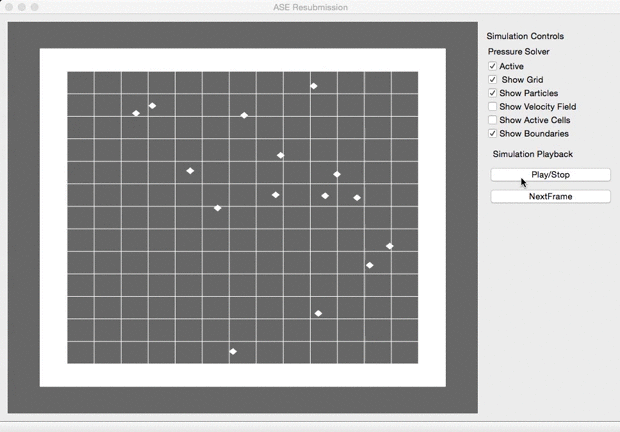

#Animation Software Engineering

This is the software developed for the ASE module at Bournemouth University.

The software requires C++11 and uses the NGL library for the visualization system and the Eigen library for matrix calculations.

The program is a simple implementation of a 2D Mac-Grid for fluid simulation. It provides basic methods to display different aspects of the simulation, like particles position and active cells.

The project also includes a rudimental implementation of the FLIP algorithm as described in (Bridson,2011).

#Limitations:
A set of methods to implement a pressure solver (Bridson,2011) is included in the project, but the pressure solver is not working as expected.
The simulation assumes the presence of a solid bounding box, which contains the fluid.

#References:
Bridson,R, 2011. Fluid Simulation for Computer Graphics. 2nd ed.

  

